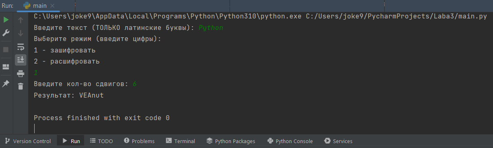
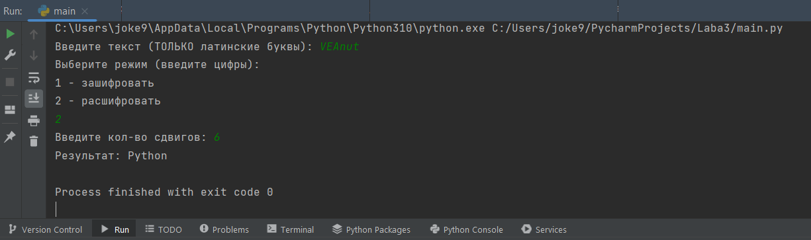
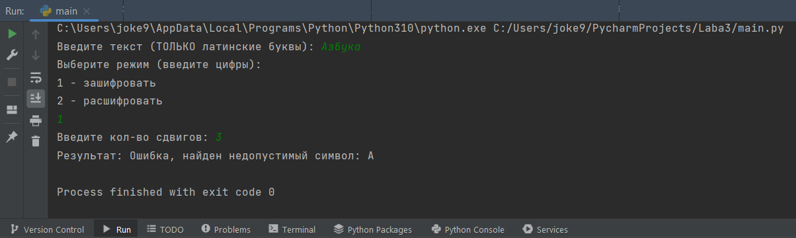

# Прикладная информатика / Лабораторная работа №3
## Описание
- Автор программы - Шляпникова Елена
- Краткое описание - Программа, реализующая **шифр Цезаря**.
Реализованы функции шифрации и дешифрации.
- Среда - Программа написана в PyCharm IDE, версия Python 3.10
## Тестирование
### Тест 1 (шифрование слова)

### Тест 2 (расшифровка слова)

### Тест 3 (проверка введенных данных)
